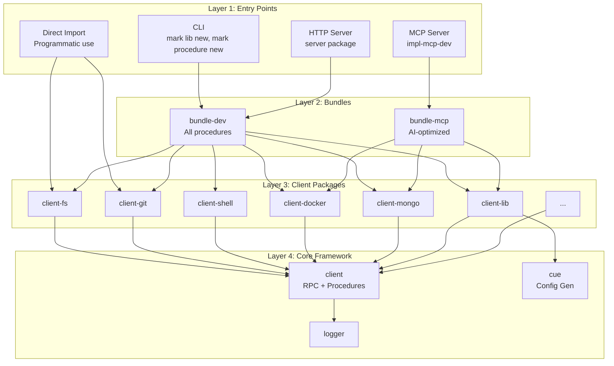
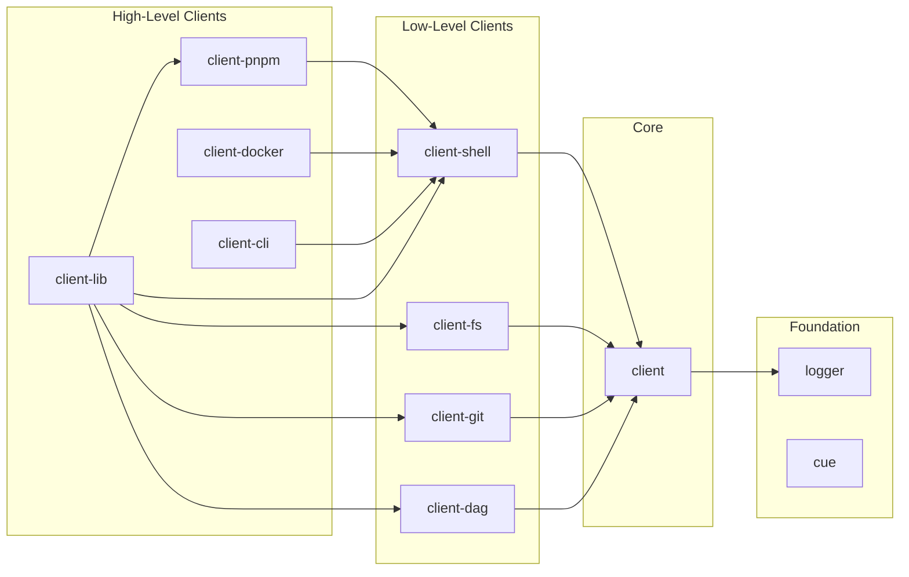
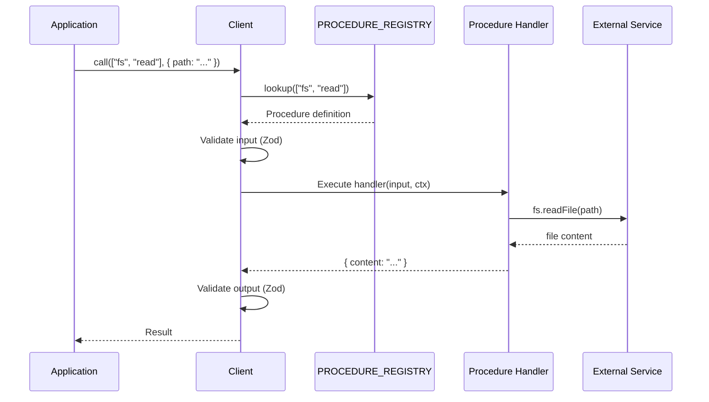
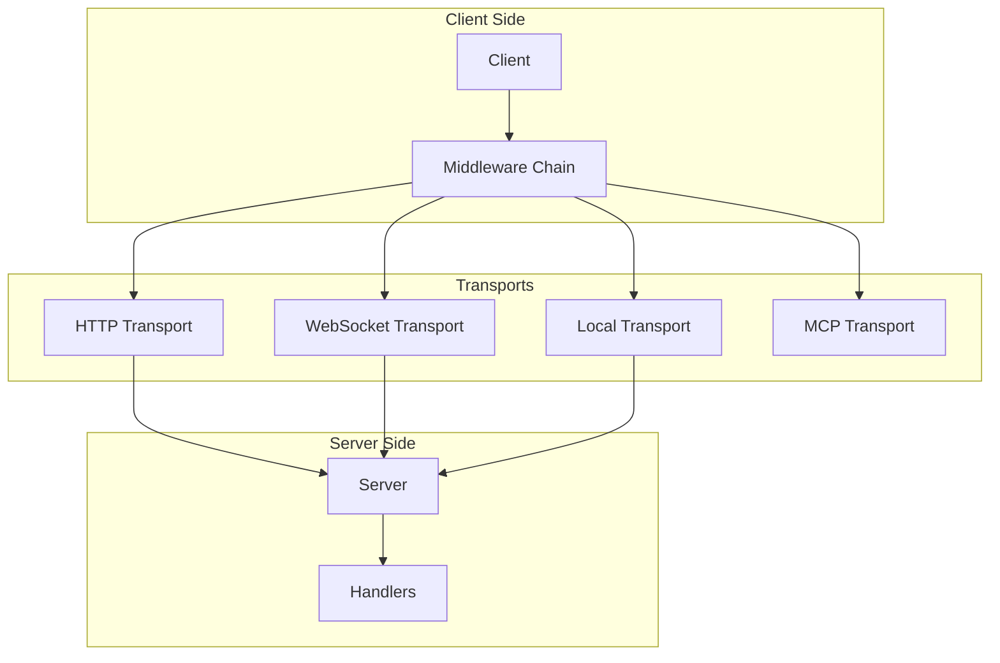
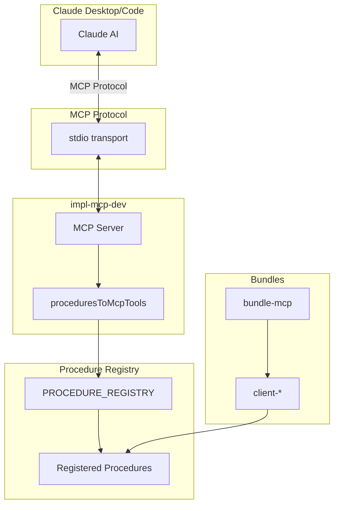
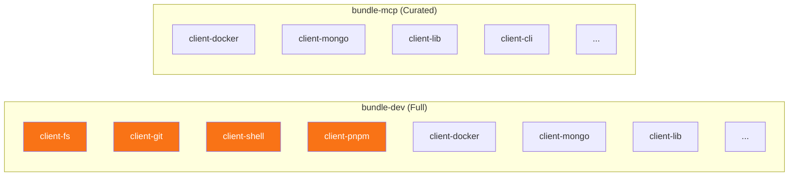

# Mark Ecosystem Architecture

> Comprehensive architecture documentation for the Mark procedure ecosystem.

## Table of Contents

- [System Overview](#system-overview)
- [Package Dependency Graph](#package-dependency-graph)
- [Data Flow](#data-flow)
- [Procedure System](#procedure-system)
- [Transport Layer](#transport-layer)
- [MCP Integration](#mcp-integration)
- [Bundle Composition](#bundle-composition)

---

## System Overview

The Mark ecosystem is organized into **layers** with clear responsibilities:



### ASCII Diagram

```
┌─────────────────────────────────────────────────────────────────────────────┐
│                           LAYER 1: ENTRY POINTS                              │
│                                                                              │
│  ┌─────────────┐  ┌─────────────┐  ┌─────────────┐  ┌─────────────┐        │
│  │    CLI      │  │ MCP Server  │  │ HTTP Server │  │   Direct    │        │
│  │  mark ...   │  │  (Claude)   │  │  REST API   │  │   Import    │        │
│  └──────┬──────┘  └──────┬──────┘  └──────┬──────┘  └──────┬──────┘        │
└─────────┼────────────────┼────────────────┼────────────────┼────────────────┘
          │                │                │                │
          ▼                ▼                ▼                ▼
┌─────────────────────────────────────────────────────────────────────────────┐
│                           LAYER 2: BUNDLES                                   │
│                                                                              │
│  ┌─────────────────────────────────┐  ┌─────────────────────────────────┐  │
│  │          bundle-dev             │  │          bundle-mcp             │  │
│  │                                 │  │                                 │  │
│  │  All procedures (100+)          │  │  Curated for AI (50+)          │  │
│  │  • fs, git, shell, pnpm        │  │  • lib, cli, procedure, cue    │  │
│  │  • docker, mongo, sqlite       │  │  • docker, mongo, sqlite       │  │
│  │  • lib, cli, procedure         │  │  • vitest, test, snapshot      │  │
│  └────────────────┬────────────────┘  └────────────────┬────────────────┘  │
└───────────────────┼────────────────────────────────────┼────────────────────┘
                    │                                    │
                    ▼                                    ▼
┌─────────────────────────────────────────────────────────────────────────────┐
│                        LAYER 3: CLIENT PACKAGES                              │
│                                                                              │
│  ┌─────────┐ ┌─────────┐ ┌─────────┐ ┌─────────┐ ┌─────────┐ ┌─────────┐  │
│  │client-fs│ │client-  │ │client-  │ │client-  │ │client-  │ │client-  │  │
│  │         │ │  git    │ │ shell   │ │ docker  │ │  mongo  │ │  lib    │  │
│  │ fs.read │ │git.clone│ │shell.run│ │docker.ps│ │mongo.*  │ │lib.scan │  │
│  │fs.write │ │git.pull │ │shell.   │ │docker.  │ │         │ │lib.new  │  │
│  │ fs.list │ │git.push │ │  exec   │ │  build  │ │         │ │lib.     │  │
│  │  ...    │ │  ...    │ │  ...    │ │  ...    │ │         │ │ refresh │  │
│  └────┬────┘ └────┬────┘ └────┬────┘ └────┬────┘ └────┬────┘ └────┬────┘  │
│       │          │          │          │          │          │           │
│       └──────────┴──────────┴──────────┴──────────┴──────────┘           │
│                                    │                                       │
└────────────────────────────────────┼───────────────────────────────────────┘
                                     │
                                     ▼
┌─────────────────────────────────────────────────────────────────────────────┐
│                         LAYER 4: CORE FRAMEWORK                              │
│                                                                              │
│  ┌─────────────────────────────────────────────────────────────────────┐   │
│  │                        @mark1russell7/client                         │   │
│  │                                                                       │   │
│  │  ┌─────────────────┐  ┌─────────────────┐  ┌─────────────────┐      │   │
│  │  │ Procedure System│  │   Client Core   │  │   Middleware    │      │   │
│  │  │                 │  │                 │  │                 │      │   │
│  │  │ • Registry      │  │ • Client class  │  │ • Retry         │      │   │
│  │  │ • Definition    │  │ • call()        │  │ • Cache         │      │   │
│  │  │ • Validation    │  │ • stream()      │  │ • Timeout       │      │   │
│  │  │ • Execution     │  │ • exec()        │  │ • Auth          │      │   │
│  │  └─────────────────┘  └─────────────────┘  └─────────────────┘      │   │
│  │                                                                       │   │
│  │  ┌─────────────────┐  ┌─────────────────┐  ┌─────────────────┐      │   │
│  │  │   Transports    │  │   Collections   │  │   Components    │      │   │
│  │  │                 │  │                 │  │                 │      │   │
│  │  │ • HTTP          │  │ • HashMap       │  │ • SSR support   │      │   │
│  │  │ • WebSocket     │  │ • ArrayList     │  │ • Type-safe     │      │   │
│  │  │ • Local         │  │ • PriorityQueue │  │ • Serializable  │      │   │
│  │  │ • Mock          │  │ • LRU/TTL       │  │                 │      │   │
│  │  └─────────────────┘  └─────────────────┘  └─────────────────┘      │   │
│  └─────────────────────────────────────────────────────────────────────┘   │
│                                                                              │
│  ┌──────────────────┐  ┌──────────────────┐  ┌──────────────────┐         │
│  │       cue        │  │      logger      │  │    ecosystem     │         │
│  │ Config generation│  │ Structured logs  │  │ Package manifest │         │
│  └──────────────────┘  └──────────────────┘  └──────────────────┘         │
└─────────────────────────────────────────────────────────────────────────────┘
```

---

## Package Dependency Graph

### Core Dependencies



### Full Dependency Matrix

```
┌─────────────────────────────────────────────────────────────────────────────┐
│                         DEPENDENCY MATRIX                                    │
├────────────────────┬────────────────────────────────────────────────────────┤
│ Package            │ Depends On                                              │
├────────────────────┼────────────────────────────────────────────────────────┤
│ client             │ logger, ws                                              │
│ cue                │ (standalone)                                            │
│ logger             │ (standalone)                                            │
│ ecosystem          │ (standalone - manifest only)                            │
├────────────────────┼────────────────────────────────────────────────────────┤
│ client-shell       │ client                                                  │
│ client-fs          │ client                                                  │
│ client-git         │ client                                                  │
│ client-dag         │ client                                                  │
├────────────────────┼────────────────────────────────────────────────────────┤
│ client-pnpm        │ client, client-shell                                   │
│ client-docker      │ client, client-shell                                   │
│ client-cli         │ client, client-shell                                   │
│ client-test        │ client, client-shell                                   │
├────────────────────┼────────────────────────────────────────────────────────┤
│ client-lib         │ client, client-shell, client-git, client-fs,           │
│                    │ client-dag, client-pnpm                                │
├────────────────────┼────────────────────────────────────────────────────────┤
│ client-mongo       │ client, mongodb                                        │
│ client-sqlite      │ client, sql.js                                         │
│ client-s3          │ client, @aws-sdk/client-s3                            │
├────────────────────┼────────────────────────────────────────────────────────┤
│ bundle-dev         │ all client-* packages                                  │
│ bundle-mcp         │ curated client-* packages                              │
├────────────────────┼────────────────────────────────────────────────────────┤
│ mcp                │ client, zod                                            │
│ client-mcp         │ client, mcp, @modelcontextprotocol/sdk                │
│ impl-mcp-dev       │ client, client-mcp, bundle-mcp                        │
└────────────────────┴────────────────────────────────────────────────────────┘
```

---

## Data Flow

### Procedure Call Flow



### ASCII Version

```
┌─────────────────────────────────────────────────────────────────────────────┐
│                         PROCEDURE CALL FLOW                                  │
└─────────────────────────────────────────────────────────────────────────────┘

  Application                Client                Registry              Handler
      │                         │                     │                     │
      │  call(["fs","read"])    │                     │                     │
      │────────────────────────▶│                     │                     │
      │                         │                     │                     │
      │                         │  lookup(path)       │                     │
      │                         │────────────────────▶│                     │
      │                         │                     │                     │
      │                         │◀────────────────────│                     │
      │                         │   Procedure def     │                     │
      │                         │                     │                     │
      │                         │  Validate input     │                     │
      │                         │◀─────────┐          │                     │
      │                         │          │          │                     │
      │                         │──────────┘          │                     │
      │                         │                     │                     │
      │                         │  Execute handler    │                     │
      │                         │────────────────────────────────────────────▶
      │                         │                     │                     │
      │                         │◀────────────────────────────────────────────
      │                         │   Result            │                     │
      │                         │                     │                     │
      │                         │  Validate output    │                     │
      │                         │◀─────────┐          │                     │
      │                         │          │          │                     │
      │                         │──────────┘          │                     │
      │                         │                     │                     │
      │◀────────────────────────│                     │                     │
      │   Typed result          │                     │                     │
      │                         │                     │                     │
```

---

## Procedure System

### Procedure Definition

```mermaid
graph TB
    subgraph "Procedure Definition"
        Path[path: string[]]
        Input[input: ZodSchema]
        Output[output: ZodSchema]
        Handler[handler: Function]
        Meta[metadata: Object]
    end

    subgraph "Registration"
        Registry[PROCEDURE_REGISTRY]
        AutoReg[Auto-registration<br/>via import]
    end

    subgraph "Execution"
        Client[Client.call()]
        Validation[Schema Validation]
        Execution[Handler Execution]
    end

    Path --> Registry
    Input --> Registry
    Output --> Registry
    Handler --> Registry
    Meta --> Registry
    AutoReg --> Registry

    Registry --> Client
    Client --> Validation
    Validation --> Execution
```

### Procedure Lifecycle

```
┌─────────────────────────────────────────────────────────────────────────────┐
│                        PROCEDURE LIFECYCLE                                   │
└─────────────────────────────────────────────────────────────────────────────┘

1. DEFINITION
   ┌────────────────────────────────────────────────────────────────────────┐
   │  const readFile = createProcedure()                                    │
   │    .path(["fs", "read"])                                               │
   │    .input(z.object({ path: z.string() }))                              │
   │    .output(z.object({ content: z.string() }))                          │
   │    .handler(async (input) => { ... })                                  │
   │    .build();                                                           │
   └────────────────────────────────────────────────────────────────────────┘
                                    │
                                    ▼
2. REGISTRATION
   ┌────────────────────────────────────────────────────────────────────────┐
   │  registerProcedures([readFile]);                                       │
   │  // or auto-register via import side-effect                            │
   │  import "@mark1russell7/client-fs/register.js";                       │
   └────────────────────────────────────────────────────────────────────────┘
                                    │
                                    ▼
3. DISCOVERY
   ┌────────────────────────────────────────────────────────────────────────┐
   │  PROCEDURE_REGISTRY.list() → [{ path: ["fs", "read"], ... }, ...]     │
   │  PROCEDURE_REGISTRY.get(["fs", "read"]) → Procedure                   │
   └────────────────────────────────────────────────────────────────────────┘
                                    │
                                    ▼
4. EXECUTION
   ┌────────────────────────────────────────────────────────────────────────┐
   │  const result = await client.call(["fs", "read"], { path: "/etc" });  │
   │  // Input validated → Handler executed → Output validated → Returned   │
   └────────────────────────────────────────────────────────────────────────┘
```

---

## Transport Layer

### Transport Architecture



### Transport Comparison

```
┌─────────────────────────────────────────────────────────────────────────────┐
│                        TRANSPORT COMPARISON                                  │
├─────────────┬───────────┬───────────┬───────────┬───────────────────────────┤
│ Transport   │ Protocol  │ Streaming │ Use Case  │ Notes                      │
├─────────────┼───────────┼───────────┼───────────┼───────────────────────────┤
│ HTTP        │ HTTP/1.1  │ No        │ REST API  │ Standard request/response │
│ WebSocket   │ WS        │ Yes       │ Real-time │ Bidirectional streaming   │
│ Local       │ In-process│ Yes       │ Testing   │ No network overhead       │
│ MCP (stdio) │ stdio     │ No        │ Claude    │ Model Context Protocol    │
└─────────────┴───────────┴───────────┴───────────┴───────────────────────────┘
```

---

## MCP Integration

### MCP Architecture



### MCP Flow

```
┌─────────────────────────────────────────────────────────────────────────────┐
│                            MCP FLOW                                          │
└─────────────────────────────────────────────────────────────────────────────┘

1. STARTUP
   ┌────────────────────────────────────────────────────────────────────────┐
   │  Claude starts MCP server via stdio                                    │
   │                                                                         │
   │  claude_desktop_config.json:                                           │
   │  {                                                                      │
   │    "mcpServers": {                                                      │
   │      "dev-tools": {                                                     │
   │        "command": "node",                                               │
   │        "args": ["/path/to/impl-mcp-dev/dist/server.js"]               │
   │      }                                                                  │
   │    }                                                                    │
   │  }                                                                      │
   └────────────────────────────────────────────────────────────────────────┘
                                    │
                                    ▼
2. TOOL DISCOVERY
   ┌────────────────────────────────────────────────────────────────────────┐
   │  Claude → ListToolsRequest                                             │
   │                                                                         │
   │  Server:                                                                │
   │  1. import "@mark1russell7/bundle-mcp/register.js"                    │
   │  2. procedures = PROCEDURE_REGISTRY.list()                             │
   │  3. tools = proceduresToMcpTools(procedures)                           │
   │                                                                         │
   │  Server → ListToolsResponse: [{ name: "docker.ps", ... }, ...]        │
   └────────────────────────────────────────────────────────────────────────┘
                                    │
                                    ▼
3. TOOL EXECUTION
   ┌────────────────────────────────────────────────────────────────────────┐
   │  Claude → CallToolRequest: { name: "docker.ps", arguments: {} }       │
   │                                                                         │
   │  Server:                                                                │
   │  1. procedure = PROCEDURE_REGISTRY.get(["docker", "ps"])              │
   │  2. result = await procedure.handler({}, ctx)                          │
   │                                                                         │
   │  Server → CallToolResponse: { content: [{ type: "text", ... }] }      │
   └────────────────────────────────────────────────────────────────────────┘
```

---

## Bundle Composition

### Bundle Architecture



### Bundle Comparison Table

```
┌─────────────────────────────────────────────────────────────────────────────┐
│                        BUNDLE COMPARISON                                     │
├─────────────────────────────────┬─────────────────────┬─────────────────────┤
│ Package Category                │ bundle-dev          │ bundle-mcp          │
├─────────────────────────────────┼─────────────────────┼─────────────────────┤
│ Low-level FS/Git/Shell/PNPM     │ ✓ Included          │ ✗ Excluded          │
│ (fs.*, git.*, shell.*, pnpm.*)  │                     │ (Claude has shell)  │
├─────────────────────────────────┼─────────────────────┼─────────────────────┤
│ Ecosystem Management            │ ✓ Included          │ ✓ Included          │
│ (lib.*, cli.*, procedure.*)     │                     │                     │
├─────────────────────────────────┼─────────────────────┼─────────────────────┤
│ Infrastructure                  │ ✓ Included          │ ✓ Included          │
│ (docker.*, snapshot.*)          │                     │                     │
├─────────────────────────────────┼─────────────────────┼─────────────────────┤
│ Databases                       │ ✓ Included          │ ✓ Included          │
│ (mongo.*, db.*, s3.*)           │                     │                     │
├─────────────────────────────────┼─────────────────────┼─────────────────────┤
│ Testing                         │ ✓ Included          │ ✓ Included          │
│ (vitest.*, test.*)              │                     │                     │
├─────────────────────────────────┼─────────────────────┼─────────────────────┤
│ Total Procedures                │ ~100+               │ ~50+                │
├─────────────────────────────────┼─────────────────────┼─────────────────────┤
│ Primary Use Case                │ CLI / Development   │ MCP / AI Integration│
└─────────────────────────────────┴─────────────────────┴─────────────────────┘
```

---

## See Also

- [README](./README.md) - Ecosystem overview
- [Procedures](./PROCEDURES.md) - Complete procedure catalog
- [Onboarding](./ONBOARDING.md) - Getting started guide
- [Packages](./PACKAGES.md) - Detailed package descriptions
