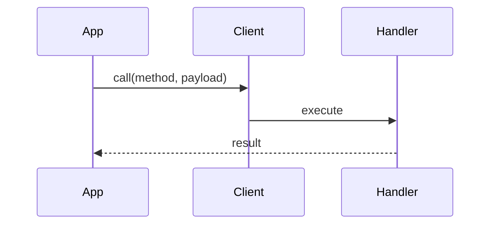

# Documentation Audit Report

> Honest assessment of the current state of documentation across the Mark ecosystem.

**Audit Date:** 2026-01-19
**Total Packages Audited:** 47
**Reference Standard:** `client/README.md` (1067 lines)

---

## Executive Summary

The documentation quality is **inconsistent** across the ecosystem. While some packages have excellent documentation with Mermaid diagrams, badges, and comprehensive API references, others have minimal ASCII-only documentation that doesn't meet the gold standard.

### Key Findings

| Metric | Count | Percentage |
|--------|-------|------------|
| Packages with READMEs | 47/47 | 100% |
| Packages with Mermaid diagrams | ~15 | 32% |
| Packages with badges | ~20 | 43% |
| Packages with Table of Contents | ~12 | 26% |
| Packages with sequence diagrams | 1 | 2% |
| Packages meeting gold standard | ~8 | 17% |

---

## Tiered Quality Assessment

### Tier 1: Gold Standard (8 packages)

These packages have comprehensive documentation matching the `client/README.md` standard:

| Package | Mermaid | Badges | TOC | API Docs | Examples | Lines |
|---------|---------|--------|-----|----------|----------|-------|
| **client** | ✅ 2 | ✅ 4 | ✅ | ✅ Full | ✅ 10+ | 1067 |
| **client-fs** | ✅ 2 | ✅ 3 | ✅ | ✅ Full | ✅ 5+ | ~500 |
| **client-git** | ✅ 3 | ✅ 2 | ✅ | ✅ Full | ✅ 5+ | ~600 |
| **client-pnpm** | ✅ 2 | ✅ 2 | ✅ | ✅ Full | ✅ 5+ | ~400 |
| **client-mongo** | ✅ 3 | ✅ 4 | ✅ | ✅ Full | ✅ 10+ | ~1200 |
| **docker-mongo** | ✅ 2 | ✅ 4 | ✅ | ✅ Full | ✅ 5+ | ~700 |
| **docker-sqlite** | ✅ 2 | ✅ 4 | ✅ | ✅ Full | ✅ 5+ | ~900 |
| **bundle-dev** | ✅ 2 | ✅ 3 | ✅ | ✅ Full | ✅ 5+ | ~400 |

**Characteristics:**
- Multiple Mermaid diagrams (architecture + dependency flow)
- Consistent badge styling
- Full procedure documentation with TypeScript interfaces
- Multiple real-world examples
- Cross-references to related packages

---

### Tier 2: Good Quality (12 packages)

Decent documentation but missing some gold standard elements:

| Package | Mermaid | Badges | TOC | API Docs | Issue |
|---------|---------|--------|-----|----------|-------|
| **client-shell** | ❌ ASCII | ✅ 3 | ✅ | ✅ Full | No Mermaid |
| **client-lib** | ❌ ASCII | ❌ | ❌ | ✅ Full | No Mermaid, badges, TOC |
| **client-cue** | ❌ ASCII | ❌ | ❌ | ✅ Full | No Mermaid, badges, TOC |
| **client-vitest** | ❌ ASCII | ❌ | ❌ | ✅ Full | No Mermaid, badges, TOC |
| **client-test** | ✅ 2 | ✅ 2 | ✅ | ✅ | Good but shorter |
| **client-splay** | ❌ ASCII | ❌ | ❌ | ✅ Full | No Mermaid, badges, TOC |
| **client-mcp** | ❌ ASCII | ❌ | ❌ | ✅ Partial | No Mermaid, badges |
| **impl-mcp-dev** | ❌ ASCII | ❌ | ❌ | ✅ Partial | No Mermaid, badges |
| **mcp** | ❌ ASCII | ❌ | ❌ | ✅ Partial | No Mermaid, badges |
| **server** | ❌ ASCII | ❌ | ❌ | ✅ Partial | Minimal |
| **bundle-mcp** | ✅ 1 | ✅ 4 | ✅ | ✅ Full | Newly created, good |
| **cue** | ✅ 3 | ✅ 4 | ✅ | ✅ Full | Good |

**Common Issues:**
- ASCII diagrams instead of Mermaid
- Missing badges
- Missing Table of Contents
- Shorter than gold standard

---

### Tier 3: Minimal Quality (15+ packages)

Basic documentation that needs significant enhancement:

| Package | Current State | Primary Issue |
|---------|---------------|---------------|
| client-dag | ASCII only, minimal | Needs Mermaid, expansion |
| client-procedure | Minimal | Needs full docs |
| client-collections | Minimal | Needs full docs |
| client-snapshot | Minimal | Needs full docs |
| client-s3 | Unknown | Needs verification |
| client-server | Minimal | Needs full docs |
| client-connection | Minimal | Needs full docs |
| client-logger | Minimal | Needs full docs |
| client-node | Minimal | Needs full docs |
| client-vite | Minimal | Needs full docs |
| mock-client | Minimal | Needs full docs |
| mock-fs | Minimal | Needs full docs |
| mock-logger | Minimal | Needs full docs |
| scaffold | Minimal | Needs full docs |
| splay | Needs verification | Unknown |
| splay-react | Needs verification | Unknown |

---

## Specific Issues Found

### 1. Inconsistent Diagram Types

**Problem:** Some packages use Mermaid, others use ASCII.

```
Gold Standard (Mermaid):
┌─────────────────────────────────┐
│ ```mermaid                      │
│ graph TB                        │
│     A --> B                     │
│ ```                             │
│ Renders as interactive diagram  │
└─────────────────────────────────┘

Lower Quality (ASCII):
┌─────────────────────────────────┐
│ ```                             │
│ ┌───────┐                       │
│ │   A   │                       │
│ └───┬───┘                       │
│     │                           │
│     ▼                           │
│ ┌───────┐                       │
│ │   B   │                       │
│ └───────┘                       │
│ ```                             │
│ Static text only                │
└─────────────────────────────────┘
```

**Affected Packages:** client-lib, client-cue, client-vitest, client-shell, client-mcp, mcp, impl-mcp-dev, server, client-splay

### 2. Missing Badges

**Problem:** Only ~43% of packages have badges.

**Gold Standard:**
```markdown
[]
[]
[]
[]
```

**Missing in:** client-lib, client-cue, client-vitest, client-mcp, mcp, impl-mcp-dev, server, client-splay, and ~20 others

### 3. Missing Table of Contents

**Problem:** Only ~26% of packages have TOC.

**Gold Standard:**
```markdown
## Table of Contents

- [Overview](#overview)
- [Installation](#installation)
- [Architecture](#architecture)
- [API Reference](#api-reference)
- [Examples](#examples)
```

**Missing in:** Most Tier 2 and all Tier 3 packages

### 4. Missing Sequence Diagrams

**Problem:** Only `client/README.md` has a sequence diagram showing request flow.

**Gold Standard includes:**


**Missing in:** ALL other packages

### 5. Inconsistent API Documentation

**Gold Standard:**
```typescript
interface ProcedureInput {
  path: string;     // Description of field
  encoding?: string; // Optional with default
}

interface ProcedureOutput {
  result: string;
  stats: Stats;
}
```

**Problems Found:**
- Some packages have full TypeScript interfaces
- Some have only partial documentation
- Some are missing default values
- Some are missing field descriptions

### 6. Missing Integration Sections

**Gold Standard includes:**
```markdown
## Integration with Ecosystem

### Connection Management
Use with `@mark1russell7/client-connection`...

### Shell Execution
Use with `@mark1russell7/client-shell`...
```

**Missing in:** Most packages don't explain how they fit into the ecosystem

---

## Package-by-Package Gaps

### client-lib
```
Missing:
- [ ] Mermaid diagrams (has ASCII only)
- [ ] Badges
- [ ] Table of Contents
- [ ] Sequence diagram for DAG execution
Has:
- [x] Good ASCII architecture diagram
- [x] Full procedure documentation
- [x] TypeScript interfaces
```

### client-cue
```
Missing:
- [ ] Mermaid diagrams (has ASCII only)
- [ ] Badges
- [ ] Table of Contents
Has:
- [x] Feature dependency diagram (ASCII)
- [x] Full procedure documentation
- [x] Workflow diagram (ASCII)
```

### client-vitest
```
Missing:
- [ ] Mermaid diagrams
- [ ] Badges
- [ ] Table of Contents
- [ ] Coverage configuration details
Has:
- [x] Basic ASCII architecture
- [x] Input/Output interfaces
- [x] CLI usage examples
```

### client-mcp
```
Missing:
- [ ] Mermaid diagrams
- [ ] Badges
- [ ] Table of Contents
- [ ] SSE documentation
- [ ] Full type definitions
Has:
- [x] ASCII architecture diagram
- [x] Quick start example
- [x] Configuration options
```

### mcp
```
Missing:
- [ ] Mermaid diagrams
- [ ] Badges
- [ ] Table of Contents
- [ ] Full zodToJsonSchema documentation
- [ ] All type exports
Has:
- [x] ASCII architecture diagram
- [x] Basic usage example
- [x] Filter documentation
```

### impl-mcp-dev
```
Missing:
- [ ] Mermaid diagrams
- [ ] Badges
- [ ] Table of Contents
- [ ] Detailed bundle configuration
Has:
- [x] ASCII architecture diagram
- [x] Claude Desktop setup
- [x] Environment variables table
- [x] Troubleshooting section
```

### server
```
Missing:
- [ ] Mermaid diagrams
- [ ] Badges
- [ ] Table of Contents
- [ ] Full API reference
- [ ] TypeScript interfaces
Has:
- [x] ASCII architecture diagram
- [x] CLI usage
- [x] Options table
```

### client-splay
```
Missing:
- [ ] Mermaid diagrams
- [ ] Badges
- [ ] Table of Contents
Has:
- [x] ASCII architecture diagram
- [x] Full API reference
- [x] Stream utilities documentation
```

---

## Recommendations

### Priority 1: Add Mermaid Diagrams (High Impact)

Convert ASCII diagrams to Mermaid in these packages:
1. client-lib
2. client-cue
3. client-vitest
4. client-mcp
5. mcp
6. impl-mcp-dev
7. server
8. client-splay
9. client-shell

### Priority 2: Add Badges (Medium Impact)

Add consistent badge set to all packages:
```markdown
[]
[]
[]
```

### Priority 3: Add Table of Contents (Medium Impact)

Add TOC to all packages with 4+ sections.

### Priority 4: Add Sequence Diagrams (Low-Medium Impact)

Add sequence diagrams showing:
- Procedure call flow
- MCP tool execution flow
- DAG traversal flow

### Priority 5: Standardize API Documentation

Ensure all packages have:
- Full TypeScript interfaces
- Field descriptions
- Default values noted
- Example usage for each procedure

---

## Documentation Template Checklist

Every package README should include:

```markdown
# @mark1russell7/PACKAGE_NAME

[![License: MIT]...] ← BADGES

> One-line description ← TAGLINE

## Table of Contents ← NAVIGATION

## Overview ← WHAT IT DOES
- Bullet points of features

## Architecture ← HOW IT WORKS
```mermaid ← MERMAID DIAGRAM
graph TB
```

## Installation ← HOW TO INSTALL

## Quick Start ← MINIMAL EXAMPLE

## API Reference ← COMPLETE DOCUMENTATION
### procedure.name
- Input interface
- Output interface
- Example

## Examples ← REAL-WORLD USAGE

## Integration ← ECOSYSTEM CONTEXT

## Requirements ← DEPENDENCIES

## License
```

---

## Conclusion

**Current State:** Documentation quality varies significantly. ~17% of packages meet the gold standard, ~26% are good but incomplete, and the remaining ~57% need substantial work.

**Main Issues:**
1. Inconsistent use of Mermaid vs ASCII diagrams
2. Missing badges on most packages
3. Missing Table of Contents
4. No sequence diagrams (except in client)
5. Inconsistent API documentation depth

**Recommended Action:** Systematic documentation upgrade starting with the most-used packages (client-lib, client-shell, MCP packages) and using the `client/README.md` as the template.
