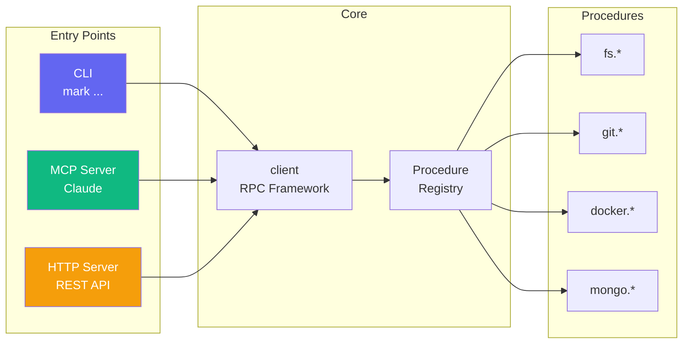

# Mark Ecosystem Documentation

[](https://opensource.org/licenses/MIT)
[](https://www.typescriptlang.org/)
[](https://nodejs.org/)

> Comprehensive documentation for the Mark procedure ecosystem - a modular TypeScript framework for building type-safe RPC systems with AI integration.

## Quick Navigation

| Document | Description |
|----------|-------------|
| [Architecture](./ARCHITECTURE.md) | System architecture, package relationships, and data flow diagrams |
| [Procedures](./PROCEDURES.md) | Complete catalog of all available procedures |
| [Onboarding](./ONBOARDING.md) | First-time user guide and installation instructions |
| [Packages](./PACKAGES.md) | Detailed package descriptions and dependencies |

## What is the Mark Ecosystem?

The Mark ecosystem is a **modular TypeScript framework** for building and consuming **type-safe RPC procedures**. It provides:

- **Universal RPC Framework** - Protocol-agnostic client/server with HTTP, WebSocket, and local transports
- **Procedure System** - Type-safe, schema-validated procedures with auto-discovery
- **AI Integration** - First-class MCP (Model Context Protocol) support for Claude integration
- **Ecosystem Management** - Tools for managing monorepos with 40+ packages



## Package Categories

### Core Packages

| Package | Description |
|---------|-------------|
| [@mark1russell7/client](https://github.com/mark1russell7/client) | Universal RPC framework with middleware, procedures, components, and collections |
| [@mark1russell7/cue](https://github.com/mark1russell7/cue) | Configuration generation from dependencies.json |
| [@mark1russell7/logger](https://github.com/mark1russell7/logger) | Structured logging with levels and formatters |
| [@mark1russell7/ecosystem](https://github.com/mark1russell7/ecosystem) | Ecosystem manifest and package coordination |

### Client Packages (Procedures)

| Package | Namespace | Description |
|---------|-----------|-------------|
| [@mark1russell7/client-fs](https://github.com/mark1russell7/client-fs) | `fs.*` | File system operations |
| [@mark1russell7/client-git](https://github.com/mark1russell7/client-git) | `git.*` | Git operations |
| [@mark1russell7/client-shell](https://github.com/mark1russell7/client-shell) | `shell.*` | Shell command execution |
| [@mark1russell7/client-docker](https://github.com/mark1russell7/client-docker) | `docker.*` | Docker container management |
| [@mark1russell7/client-mongo](https://github.com/mark1russell7/client-mongo) | `mongo.*` | MongoDB operations |
| [@mark1russell7/client-sqlite](https://github.com/mark1russell7/client-sqlite) | `db.*` | SQLite operations |
| [@mark1russell7/client-lib](https://github.com/mark1russell7/client-lib) | `lib.*` | Ecosystem management |
| [@mark1russell7/client-procedure](https://github.com/mark1russell7/client-procedure) | `procedure.*` | Procedure scaffolding |

### Bundles

| Package | Description |
|---------|-------------|
| [@mark1russell7/bundle-dev](https://github.com/mark1russell7/bundle-dev) | Full development bundle with all procedures |
| [@mark1russell7/bundle-mcp](https://github.com/mark1russell7/bundle-mcp) | Curated bundle for MCP/AI integration |

### MCP Integration

| Package | Description |
|---------|-------------|
| [@mark1russell7/mcp](https://github.com/mark1russell7/mcp) | MCP types and Zod→JSON Schema conversion |
| [@mark1russell7/client-mcp](https://github.com/mark1russell7/client-mcp) | MCP server transport |
| [@mark1russell7/impl-mcp-dev](https://github.com/mark1russell7/impl-mcp-dev) | Ready-to-run MCP server |

## Getting Started

### Quick Install (New User)

```bash
# 1. Clone the ecosystem package
git clone https://github.com/mark1russell7/ecosystem.git ~/git/ecosystem

# 2. Clone the CLI
git clone https://github.com/mark1russell7/cli.git ~/git/cli
cd ~/git/cli && pnpm install && pnpm build

# 3. Install all ecosystem packages
node ~/git/cli/dist/index.js lib install
```

### Use with Claude (MCP)

```bash
# 1. Clone impl-mcp-dev
git clone https://github.com/mark1russell7/impl-mcp-dev.git ~/git/impl-mcp-dev
cd ~/git/impl-mcp-dev && pnpm install && pnpm build

# 2. Add to Claude Desktop config (see ONBOARDING.md for full details)
```

See [ONBOARDING.md](./ONBOARDING.md) for detailed step-by-step instructions.

## Architecture Overview

```
┌─────────────────────────────────────────────────────────────────────────────┐
│                              ENTRY POINTS                                    │
│                                                                              │
│   ┌──────────────┐    ┌──────────────┐    ┌──────────────┐                 │
│   │     CLI      │    │  MCP Server  │    │ HTTP Server  │                 │
│   │  mark ...    │    │   (Claude)   │    │  REST API    │                 │
│   └──────┬───────┘    └──────┬───────┘    └──────┬───────┘                 │
│          │                   │                   │                          │
└──────────┼───────────────────┼───────────────────┼──────────────────────────┘
           │                   │                   │
           ▼                   ▼                   ▼
┌─────────────────────────────────────────────────────────────────────────────┐
│                              BUNDLES                                         │
│                                                                              │
│   ┌──────────────────────────────┐    ┌──────────────────────────────┐     │
│   │         bundle-dev           │    │         bundle-mcp           │     │
│   │  Full development bundle     │    │  Curated for AI/MCP          │     │
│   │  (100+ procedures)           │    │  (50+ procedures)            │     │
│   └──────────────┬───────────────┘    └──────────────┬───────────────┘     │
└──────────────────┼───────────────────────────────────┼──────────────────────┘
                   │                                   │
                   ▼                                   ▼
┌─────────────────────────────────────────────────────────────────────────────┐
│                           CLIENT PACKAGES                                    │
│                                                                              │
│   ┌─────────┐ ┌─────────┐ ┌─────────┐ ┌─────────┐ ┌─────────┐ ┌─────────┐ │
│   │client-fs│ │client-  │ │client-  │ │client-  │ │client-  │ │client-  │ │
│   │  fs.*   │ │  git    │ │ shell   │ │ docker  │ │  mongo  │ │  lib    │ │
│   └────┬────┘ │  git.*  │ │ shell.* │ │docker.* │ │ mongo.* │ │  lib.*  │ │
│        │      └────┬────┘ └────┬────┘ └────┬────┘ └────┬────┘ └────┬────┘ │
└────────┼───────────┼───────────┼───────────┼───────────┼───────────┼───────┘
         │           │           │           │           │           │
         ▼           ▼           ▼           ▼           ▼           ▼
┌─────────────────────────────────────────────────────────────────────────────┐
│                              CORE                                            │
│                                                                              │
│   ┌─────────────────────────────────────────────────────────────────────┐   │
│   │                         @mark1russell7/client                        │   │
│   │                                                                       │   │
│   │  ┌─────────────┐  ┌─────────────┐  ┌─────────────┐  ┌────────────┐  │   │
│   │  │   Client    │  │  Procedure  │  │ Collections │  │ Components │  │   │
│   │  │ Middleware  │  │  Registry   │  │  Framework  │  │   System   │  │   │
│   │  └─────────────┘  └─────────────┘  └─────────────┘  └────────────┘  │   │
│   └─────────────────────────────────────────────────────────────────────┘   │
│                                                                              │
│   ┌───────────────────┐  ┌───────────────────┐  ┌───────────────────┐      │
│   │        cue        │  │      logger       │  │     ecosystem     │      │
│   │  Config generation│  │ Structured logging│  │ Package manifest  │      │
│   └───────────────────┘  └───────────────────┘  └───────────────────┘      │
└─────────────────────────────────────────────────────────────────────────────┘
```

## Key Concepts

### Procedures

Procedures are type-safe RPC endpoints with Zod schema validation:

```typescript
// Define a procedure
const readFile = createProcedure()
  .path(["fs", "read"])
  .input(z.object({ path: z.string() }))
  .output(z.object({ content: z.string() }))
  .handler(async ({ path }) => {
    const content = await fs.readFile(path, "utf8");
    return { content };
  })
  .build();

// Call a procedure
const result = await client.call(["fs", "read"], { path: "/etc/hosts" });
```

### Bundles

Bundles aggregate multiple client packages for easy consumption:

```typescript
// Import a bundle to register all its procedures
import "@mark1russell7/bundle-dev/register.js";

// Now all procedures are available
await client.call(["fs", "read"], { path: "..." });
await client.call(["git", "status"], { repoPath: "..." });
await client.call(["docker", "ps"], {});
```

### MCP Integration

Procedures are automatically exposed as MCP tools for Claude:

```typescript
// In MCP server
import { proceduresToMcpTools } from "@mark1russell7/mcp";

const tools = proceduresToMcpTools(PROCEDURE_REGISTRY.getAll());
// { name: "fs.read", inputSchema: {...}, ... }
```

## Contributing

See the individual package READMEs for contribution guidelines. General principles:

1. **Use the CLI** - Create packages with `mark lib new <name>`
2. **Use cue-config** - Generate configs with `cue-config generate`
3. **Type Safety** - All procedures must have Zod schemas
4. **Documentation** - All packages must have comprehensive READMEs

## License

MIT

## See Also

- [Architecture Documentation](./ARCHITECTURE.md)
- [Complete Procedure Catalog](./PROCEDURES.md)
- [Onboarding Guide](./ONBOARDING.md)
- [Package Details](./PACKAGES.md)
